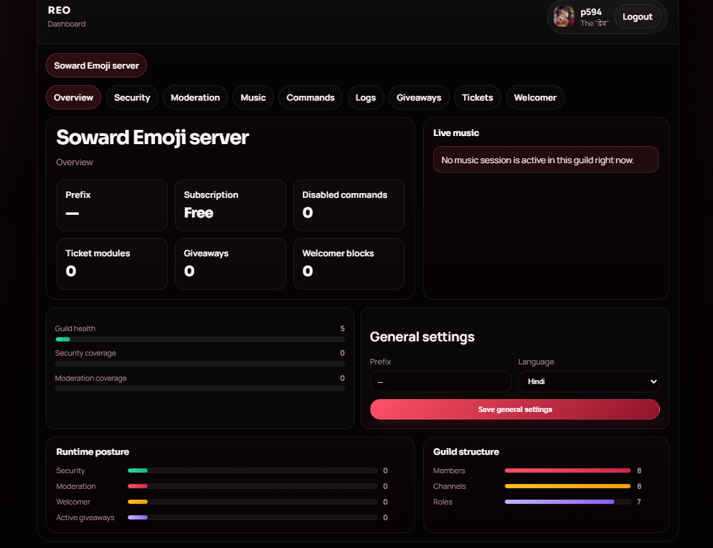
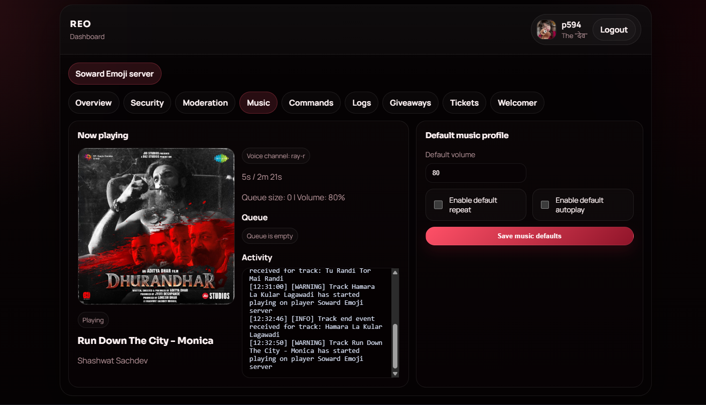

# REO

REO is a Discord bot with a built-in dashboard for moderation, security, tickets, giveaways, welcomer, music, logs, and command access.

## Showcase

### Overview



### Music



## Features

- Discord bot with hybrid commands
- MongoDB storage
- FastAPI dashboard
- Music controller with live artwork, queue, and activity
- Security and automod controls
- Tickets, giveaways, welcomer, and command management
- English and Hindi help menu support

## Stack

- Python
- `discord.py`
- `wavelink`
- FastAPI
- MongoDB

## Project Layout

- `main.py` - bot entry point
- `reo/src` - commands, events, and runtime modules
- `reo/surface` - dashboard and web routes
- `reo/engine` - bot core
- `storage` - Mongo-backed storage layer
- `secrets/.env` - local environment config

## Setup

### 1. Install dependencies

```bash
pip install -r requirements.txt
```

### 2. Create environment file

Create `secrets/.env`:

```env
TOKEN="YOUR_BOT_TOKEN"
PREFIX="-"
SHARD_COUNT=1

MONGO_URI="YOUR_MONGODB_URI"
MONGO_NAME="reo"

DISCORD_CLIENT_ID="YOUR_DISCORD_APP_ID"
DISCORD_CLIENT_SECRET="YOUR_DISCORD_CLIENT_SECRET"
DASHBOARD_BASE_URL="http://localhost:25572"
```

### 3. Discord application setup

In the Discord Developer Portal:

- copy your `Application ID` into `DISCORD_CLIENT_ID`
- copy your `Client Secret` into `DISCORD_CLIENT_SECRET`
- add this redirect URL:

```text
http://localhost:25572/dashboard/auth/callback
```

If you use a custom domain, replace the localhost URL with your real dashboard domain in both the portal and `DASHBOARD_BASE_URL`.

### 4. Start the bot

```bash
python main.py
```

### 5. Open the dashboard

```text
http://localhost:25572/dashboard
```

Login with Discord, choose a server you manage, and configure it from the dashboard.

## Dashboard Areas

- Overview
- Security
- Moderation
- Music
- Commands
- Logs
- Giveaways
- Tickets
- Welcomer

## Notes

- Only guild owners, administrators, or members with manage server access can manage a server in the dashboard.
- The music page updates live while the bot is running.
- The server language setting affects the help menu output.

## License

MIT License

Copyright (c) 2026 Codex Development
